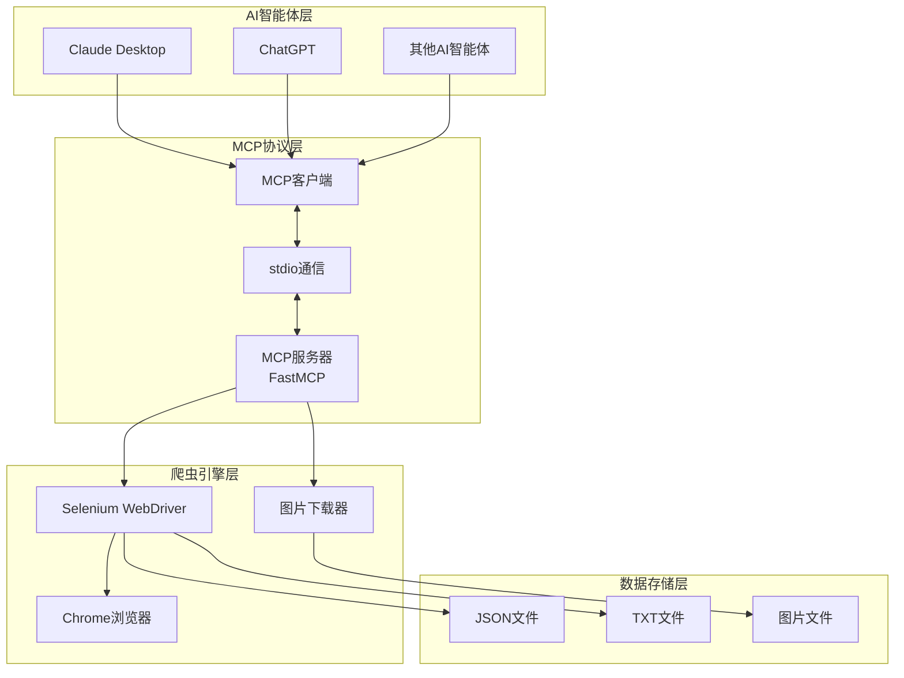

# MCP微信公众号爬虫服务器配置指南

## 1. 项目概述

MCP微信公众号爬虫服务器是一个基于FastMCP框架构建的微信公众号文章爬虫系统，通过MCP协议实现AI智能体与Selenium爬虫的无缝集成，让AI智能体能够直接访问和分析微信公众号内容。

### 核心功能

- 🤖 **FastMCP框架** - 基于FastMCP高级封装，简化MCP服务器开发
- 🕷️ **智能爬虫** - 使用Selenium自动化浏览器，支持动态内容抓取
- 🖼️ **图片处理** - 自动下载文章图片并转换为本地文件
- 📊 **内容分析** - 提供文章统计、关键词提取等分析功能
- 🔌 **标准协议** - 完全兼容MCP 1.0+规范，支持stdio通信
- 🎯 **AI集成** - 可与Claude Desktop、ChatGPT等AI智能体无缝集成

## 2. 环境要求

| 项目 | 版本/要求 | 说明 |
|------|-----------|------|
| Python | 3.10+ | 推荐使用Python 3.10或更高版本 |
| 浏览器 | Chrome/Edge | 用于Selenium自动化，支持无头模式 |
| 操作系统 | Windows/macOS/Linux | 跨平台支持 |

## 3. 安装步骤

### 3.1 克隆项目

```bash
git clone https://github.com/example/mcp-weixin-spider.git
cd MCPWeChatOfficialAccounts
```

### 3.2 安装依赖

```bash
# 安装核心依赖
pip install .

# 安装开发依赖（可选，用于开发和测试）
pip install -e .[dev]
```

### 3.3 创建必要目录

```bash
mkdir -p articles images
```

## 4. 配置说明

### 4.1 配置文件

项目使用TOML格式的配置文件 `config.toml`，支持通过配置文件和环境变量进行配置。

```toml
# MCP微信爬虫配置文件
[spider]
# 是否使用无头模式运行浏览器
headless = true

# 页面等待时间（秒）
wait_time = 10

# 是否下载文章中的图片
download_images = true

# 浏览器类型，支持'chrome'和'edge'
browser = "edge"

# ChromeDriver路径（可选，自动管理时可留空）
chrome_driver_path = ""

# EdgeDriver路径（可选，自动管理时可留空）
edge_driver_path = ""

# 文章保存目录
articles_dir = ".temp"

# 图片保存目录
images_dir = "images"

[mcp]
# MCP服务器名称
server_name = "mcp-weixin-spider"

# 传输方式（stdio或其他）
transport = "stdio"

# 是否启用调试模式
debug = false

[log]
# 日志级别（DEBUG, INFO, WARNING, ERROR, CRITICAL）
level = "INFO"

# 日志格式
format = "%(asctime)s - %(name)s - %(levelname)s - %(message)s"

# 日志文件路径（可选，留空则输出到控制台）
file = ""
```

### 4.2 环境变量

支持通过环境变量覆盖配置文件中的设置：

| 环境变量 | 对应配置项 | 说明 |
|----------|------------|------|
| HEADLESS | spider.headless | 是否使用无头模式 |
| DOWNLOAD_IMAGES | spider.download_images | 是否下载图片 |
| WAIT_TIME | spider.wait_time | 页面等待时间 |
| BROWSER | spider.browser | 浏览器类型 |
| CHROME_DRIVER_PATH | spider.chrome_driver_path | ChromeDriver路径 |
| EDGE_DRIVER_PATH | spider.edge_driver_path | EdgeDriver路径 |
| ARTICLES_DIR | spider.articles_dir | 文章保存目录 |
| IMAGES_DIR | spider.images_dir | 图片保存目录 |
| MCP_SERVER_NAME | mcp.server_name | MCP服务器名称 |
| MCP_TRANSPORT | mcp.transport | 传输方式 |
| MCP_DEBUG | mcp.debug | 是否启用调试模式 |
| LOG_LEVEL | log.level | 日志级别 |
| LOG_FILE | log.file | 日志文件路径 |

## 5. 运行方式

### 5.1 使用命令行脚本

```bash
# 启动MCP服务器（默认模式）
mcp-weixin-spider
```

### 5.2 使用模块化启动

```bash
# 启动MCP服务器（默认模式）
python -m mcp_weixin_spider

# 启动MCP服务器（显式指定server模式）
python -m mcp_weixin_spider server

# 启动交互式客户端
python -m mcp_weixin_spider client
```

### 5.3 启动状态验证

成功启动后，控制台会显示以下信息：

```
2026-03-13 21:07:23,390 - root - INFO - 使用重构后的爬虫模块
🚀 启动MCP微信爬虫服务器...
2026-03-13 21:07:23,400 - root - INFO - 启动MCP微信爬虫服务器 (FastMCP版本)
2026-03-13 21:07:23,400 - root - INFO - 配置信息: 无头模式=True, 等待时间=10秒
2026-03-13 21:07:23,401 - root - INFO - MCP微信爬虫服务器启动
```

## 6. 功能测试

### 6.1 运行测试套件

```bash
# 运行所有测试
pytest

# 运行特定测试文件
pytest tests/test_config.py
```

### 6.2 验证服务器功能

使用以下命令测试服务器功能：

```bash
python test_server.py
```

预期输出：

```
=== 测试MCP微信爬虫服务器 ===
✅ 成功连接到MCP服务器

✅ 可用工具列表: ['crawl_weixin_article', 'analyze_article_content', 'get_article_statistics', 'clear_article_cache']

=== 测试爬取文章工具 ===
测试URL: https://mp.weixin.qq.com/s/1qZ4a1a1a1a1a1a1a1a1a1a1a1a1a1a1a1a1a
⚠️  工具调用失败: Invalid URL: https://mp.weixin.qq.com/s/1qZ4a1a1a1a1a1a1a1a1a1a1a1a1a1a1a1a1a - 必须是有效的微信文章URL，以 https://mp.weixin.qq.com/ 开头
这可能是因为测试URL无效，实际使用时请提供有效的微信公众号文章URL

✅ 已关闭连接

=== 测试完成 ===
```

## 7. MCP工具接口

### 7.1 crawl_weixin_article

**功能**：爬取微信公众号文章内容和图片

**参数**：
- `url`: 微信公众号文章的URL链接
- `download_images`: 是否下载文章中的图片（默认：True）
- `custom_filename`: 自定义文件名（可选）

**返回**：包含文章内容的JSON对象

### 7.2 analyze_article_content

**功能**：分析已爬取的文章内容，提取关键信息

**参数**：
- `article_data`: 文章数据对象
- `analysis_type`: 分析类型：summary(摘要), keywords(关键词), images(图片信息), full(完整分析)（默认："full"）

**返回**：分析结果的JSON字符串

### 7.3 get_article_statistics

**功能**：获取文章统计信息（字数、图片数量等）

**参数**：
- `article_data`: 文章数据对象

**返回**：统计信息的JSON字符串

### 7.4 clear_article_cache

**功能**：清空文章缓存

**参数**：无

**返回**：操作结果的JSON字符串

## 8. 常见问题及解决方案

| 问题 | 可能原因 | 解决方案 |
|------|----------|----------|
| MCP服务显示「不可用」 | Python环境配置错误 | 检查系统PATH是否包含Python安装路径，确保在命令行可直接运行`python` |
| 爬虫运行时提示ChromeDriver未找到 | ChromeDriver未安装或版本不匹配 | 1. 下载与Chrome浏览器版本匹配的ChromeDriver<br>2. 将ChromeDriver放入系统PATH目录或项目根目录 |
| 图片下载失败 | 权限不足或目录不存在 | 1. 确保`IMAGES_DIR`目录存在<br>2. 检查目录写入权限 |
| 页面加载超时 | 网络问题或`WAIT_TIME`设置过小 | 1. 检查网络连接<br>2. 增大`WAIT_TIME`值，建议设置为15-30秒 |
| 浏览器启动失败 | 浏览器未安装或版本过旧 | 1. 确保已安装Chrome或Edge浏览器<br>2. 升级浏览器到最新版本 |

## 9. 维护建议

1. **定期更新依赖**：
   ```bash
   pip install --upgrade -e .[dev]
   ```

2. **定期清理缓存**：
   - 手动调用`clear_article_cache`工具
   - 或删除`articles`目录下的旧文件

3. **日志管理**：
   - 生产环境建议将日志输出到文件
   - 定期清理旧日志文件

4. **性能优化**：
   - 根据服务器资源调整浏览器池大小（默认5个实例）
   - 合理设置`WAIT_TIME`参数，避免过长或过短
   - 考虑使用代理IP避免被微信公众号反爬限制

5. **安全建议**：
   - 不要过度频繁使用爬虫，避免给微信服务器造成压力
   - 确保爬取行为符合相关法律法规和微信公众平台的使用条款

## 10. 配置文件说明

### 10.1 爬虫配置（[spider]）

| 配置项 | 默认值 | 说明 |
|--------|--------|------|
| headless | true | 是否使用无头模式运行浏览器 |
| wait_time | 10 | 页面等待时间（秒） |
| download_images | true | 是否下载文章中的图片 |
| browser | "edge" | 浏览器类型，支持'chrome'和'edge' |
| chrome_driver_path | "" | ChromeDriver路径（可选，自动管理时可留空） |
| edge_driver_path | "" | EdgeDriver路径（可选，自动管理时可留空） |
| articles_dir | ".temp" | 文章保存目录 |
| images_dir | "images" | 图片保存目录 |

### 10.2 MCP配置（[mcp]）

| 配置项 | 默认值 | 说明 |
|--------|--------|------|
| server_name | "mcp-weixin-spider" | MCP服务器名称 |
| transport | "stdio" | 传输方式，支持stdio和tcp |
| debug | false | 是否启用调试模式 |

### 10.3 日志配置（[log]）

| 配置项 | 默认值 | 说明 |
|--------|--------|------|
| level | "INFO" | 日志级别，支持DEBUG, INFO, WARNING, ERROR, CRITICAL |
| format | "%(asctime)s - %(name)s - %(levelname)s - %(message)s" | 日志格式 |
| file | "" | 日志文件路径（留空则输出到控制台） |

## 11. 架构说明

### 系统架构图



### 核心组件

1. **FastMCP服务器** (`src/mcp_weixin_spider/server.py`)
   - 基于FastMCP框架的高级封装
   - 提供4个核心工具
   - 浏览器池管理（默认5个实例）
   - 文章缓存机制（100条，过期时间1小时）

2. **Selenium爬虫引擎** (`src/mcp_weixin_spider/spider.py`)
   - 浏览器自动化控制
   - 智能ChromeDriver/EdgeDriver管理
   - 图片下载和格式转换
   - 多格式文件保存（JSON、TXT）

3. **配置管理** (`src/mcp_weixin_spider/config.py`)
   - TOML格式配置文件支持
   - 环境变量覆盖机制
   - 类型安全的配置访问

## 12. 开发指南

### 12.1 代码格式

使用Black进行代码格式化：

```bash
black src/ weixin_spider.py
```

### 12.2 代码检查

使用flake8进行代码检查：

```bash
flake8 src/ weixin_spider.py
```

### 12.3 类型检查

使用mypy进行类型检查：

```bash
mypy src/
```

### 12.4 测试

```bash
# 运行所有测试
pytest

# 运行特定测试文件
pytest tests/test_config.py

# 运行测试并生成覆盖率报告
pytest --cov=src/
```

## 13. 许可证

Apache License 2.0

## 14. 更新日志

### v0.1.0 (2026-03-13)

- 初始版本发布
- 实现微信公众号文章爬取功能
- 支持MCP协议
- 支持图片下载和保存
- 提供AI智能体集成接口

## 15. 联系方式

- 项目主页：https://github.com/example/mcp-weixin-spider
- 问题反馈：https://github.com/example/mcp-weixin-spider/issues
- 文档：https://github.com/example/mcp-weixin-spider/wiki

---

**配置完成！** 您的MCP微信公众号爬虫服务器已成功配置并运行。

如需进一步的帮助或支持，请参考上述文档或提交Issue到GitHub仓库。