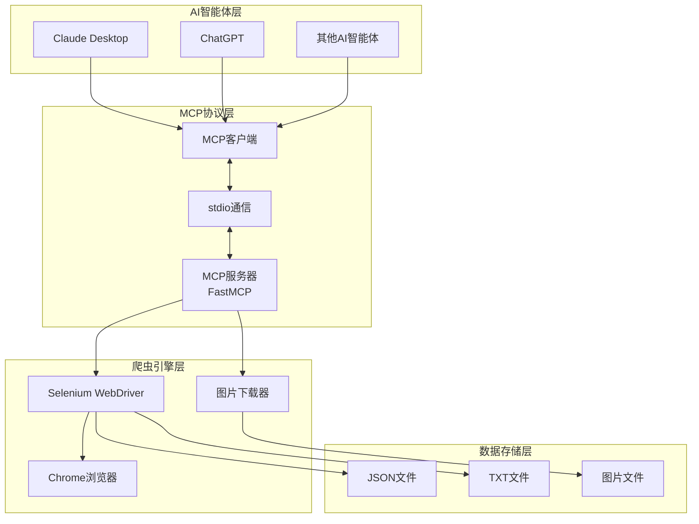

# MCP微信公众号爬虫

基于 **FastMCP** 框架构建的微信公众号文章爬虫系统，让AI智能体能够直接访问和分析微信公众号内容。通过MCP (Model Context Protocol) 标准协议，实现AI智能体与Selenium爬虫的无缝集成。

## 🎯 项目背景

在使用AI平台或智能体时，我们发现智能体无法直接访问微信公众号文章内容。为了解决这个问题，我们开发了这个基于MCP协议的爬虫服务，让AI智能体能够获取和分析微信公众号的内容。

## ✨ 核心特性

- 🤖 **FastMCP框架** - 基于FastMCP高级封装，简化MCP服务器开发
- 🕷️ **智能爬虫** - 使用Selenium自动化浏览器，支持动态内容抓取
- 🖼️ **图片处理** - 自动下载文章图片并转换为本地文件
- 📊 **内容分析** - 提供文章统计、关键词提取等分析功能
- 🔌 **标准协议** - 完全兼容MCP 1.0+规范，支持stdio通信
- 🎯 **AI集成** - 可与Claude Desktop、ChatGPT等AI智能体无缝集成
- 💻 **多种接口** - 提供Python API和交互式命令行界面
- 🧪 **依赖检查** - 自动检测和安装缺失的依赖包
- 📁 **数据存储** - 支持多种格式文件保存（JSON、TXT）
- 🚀 **性能优化** - 内存和CPU使用优化

## 🏗️ 系统架构



### 🔧 核心组件

#### 1. FastMCP服务器 (`src/mcp_weixin_spider/server.py`)

- 基于FastMCP框架的高级封装
- 提供3个核心工具：文章爬取、内容分析、统计信息
- 单例模式管理Selenium爬虫实例
- 完整的错误处理和参数验证
- 支持模块化启动和命令行脚本调用

#### 2. MCP标准客户端 (`src/mcp_weixin_spider/client.py`)

- 标准MCP协议客户端实现
- 异步通信和会话管理
- 交互式命令行界面
- Python API接口
- 支持通过命令行脚本启动

#### 3. 模块入口 (`src/mcp_weixin_spider/__main__.py`)

- 统一的模块启动入口
- 支持server和client两种运行模式
- 提供清晰的命令行帮助信息

#### 4. 配置管理 (`src/mcp_weixin_spider/config.py`)

- TOML格式配置文件支持
- 环境变量覆盖机制
- 类型安全的配置访问

#### 5. Selenium爬虫引擎 (`src/mcp_weixin_spider/spider.py`)

- Chrome浏览器自动化控制
- 智能ChromeDriver管理（自动安装和路径检测）
- 反爬虫机制处理
- 图片下载和格式转换
- 多格式文件保存
- 内存和性能优化

#### 6. 依赖检查器 (`src/mcp_weixin_spider/spider.py`)

- 自动检测系统依赖
- 提供详细的依赖缺失信息
- 支持一键安装缺失依赖

## 📁 项目结构

```
MCPWeChatOfficialAccounts/
├── src/
│   └── mcp_weixin_spider/
│       ├── __init__.py         # 包初始化文件
│       ├── __main__.py         # 模块入口点
│       ├── client.py           # MCP客户端实现
│       ├── config.py           # 配置管理
│       ├── exceptions.py       # 异常定义
│       ├── main.py             # 主函数
│       ├── server.py           # FastMCP服务器实现
│       └── spider.py           # Selenium爬虫引擎
├── weixin_spider.py            # 爬虫测试脚本
├── config.toml                 # 主配置文件
├── config.toml.example         # 配置文件示例
├── LICENSE                     # 许可证文件
├── pyproject.toml              # 项目元数据和依赖管理
└── README.md                   # 项目文档
```

## 🚀 快速开始

### 📋 环境要求

- **Python**: 3.10+
- **浏览器**: Chrome/Chromium (自动管理ChromeDriver)
- **系统**: macOS/Windows/Linux

### 📦 安装步骤

### 传统安装（使用源码）

```bash
# 1. 克隆项目
git clone https://github.com/example/mcp-weixin-spider.git
cd MCPWeChatOfficialAccounts

# 2. 安装依赖
pip install .

# 3. 开发模式安装（可选，用于开发人员）
pip install -e .[dev]
```

### 使用pip安装

```bash
# 安装最新版本
pip install mcp-weixin-spider
```

### ⚙️ 配置管理

项目使用TOML格式的配置文件，支持通过配置文件和环境变量进行配置。

#### 配置文件

配置文件说明：

```toml
[spider]
headless = true          # 是否使用无头模式运行浏览器
wait_time = 10           # 页面等待时间（秒）
download_images = true   # 是否下载文章中的图片
browser = "chrome"        # 浏览器类型，支持'chrome'和'edge'
chrome_driver_path = ""   # ChromeDriver路径（可选，自动管理时可留空）
edge_driver_path = ""     # EdgeDriver路径（可选，自动管理时可留空）
articles_dir = ".temp"     # 文章保存目录
images_dir = ".images"    # 图片保存目录

[mcp]
server_name = "mcp-weixin-spider" # MCP服务器名称
transport = "stdio"         # 传输方式（stdio或tcp）
debug = false              # 是否启用调试模式

[log]
level = "INFO"              # 日志级别（DEBUG, INFO, WARNING, ERROR, CRITICAL）
format = "%(asctime)s - %(name)s - %(levelname)s - %(message)s" # 日志格式
file = ""                   # 日志文件路径（可选，留空则输出到控制台）
```

#### 环境变量

支持通过环境变量覆盖配置文件中的设置：

| 环境变量                 | 对应配置项                       | 说明                 |
| -------------------- | --------------------------- | ------------------ |
| HEADLESS             | spider.headless             | 是否使用无头模式           |
| DOWNLOAD\_IMAGES     | spider.download\_images     | 是否下载图片             |
| WAIT\_TIME           | spider.wait\_time           | 页面等待时间             |
| BROWSER              | spider.browser              | 浏览器类型（chrome或edge） |
| CHROME\_DRIVER\_PATH | spider.chrome\_driver\_path | ChromeDriver路径（可选） |
| EDGE\_DRIVER\_PATH   | spider.edge\_driver\_path   | EdgeDriver路径（可选）   |
| ARTICLES\_DIR        | spider.articles\_dir        | 文章保存目录             |
| IMAGES\_DIR          | spider.images\_dir          | 图片保存目录             |
| MCP\_SERVER\_NAME    | mcp.server\_name            | MCP服务器名称           |
| MCP\_TRANSPORT       | mcp.transport               | 传输方式（stdio或tcp）    |
| MCP\_DEBUG           | mcp.debug                   | 是否启用调试模式           |
| LOG\_LEVEL           | log.level                   | 日志级别               |
| LOG\_FILE            | log.file                    | 日志文件路径             |

### 🎮 启动方式

#### 使用命令行脚本（推荐）

```bash
# 启动MCP服务器（默认模式）
mcp-weixin-spider
```

#### 使用模块化启动

```bash
# 启动MCP服务器（默认模式）
python -m mcp_weixin_spider

# 启动MCP服务器（显式指定server模式）
python -m mcp_weixin_spider server

# 启动交互式客户端
python -m mcp_weixin_spider client
```

#### 测试爬虫功能

```bash
# 运行爬虫测试脚本
python weixin_spider.py
```

## 🛠️ MCP工具接口

### 工具列表

| 工具名称                   | 功能描述      | 参数                                                             | 返回值             |
| ---------------------- | --------- | -------------------------------------------------------------- | --------------- |
| `crawl_weixin_article` | 爬取微信公众号文章 | `url`: 文章URL`download_images`: 是否下载图片`custom_filename`: 自定义文件名 | 包含文章内容的JSON对象   |
| `analyze_article`      | 分析文章内容    | `article_content`: 文章内容                                        | 分析结果（关键词、统计信息等） |
| `get_article_stats`    | 获取文章统计信息  | `article_content`: 文章内容                                        | 文章统计数据          |

## 👨‍💻 开发指南

### 开发环境设置

```bash
# 克隆项目
git clone https://github.com/example/mcp-weixin-spider.git
cd MCPWeChatOfficialAccounts

# 安装开发依赖
pip install -e .[dev]

# 运行代码格式化
black src/ weixin_spider.py

# 运行代码检查
flake8 src/ weixin_spider.py

# 运行类型检查
mypy src/
```

### 项目构建

```bash
# 构建项目
python -m build

# 生成的包文件将位于 dist/ 目录
```

### 测试

```bash
# 运行爬虫测试
python weixin_spider.py
```

### 贡献指南

1. 遵循PEP 8编码规范
2. 使用Black进行代码格式化
3. 添加适当的类型注解
4. 确保所有代码通过flake8检查
5. 撰写清晰的提交信息
6. 提交前运行所有检查命令

## ⚠️ 注意事项

1. **使用频率**：请勿过度频繁使用爬虫，避免给微信服务器造成压力
2. **合法性**：请确保您的爬取行为符合相关法律法规和微信公众平台的使用条款
3. **Chrome版本**：建议使用最新版本的Chrome浏览器，以获得最佳兼容性
4. **内存使用**：长时间运行可能会消耗较多内存，建议定期重启服务
5. **网络环境**：请确保网络环境稳定，避免因网络问题导致爬取失败

## 📄 许可证

Apache License 2.0

## 📝 更新日志

### v0.1.0 (2026-03-13)

- 初始版本发布
- 实现微信公众号文章爬取功能
- 支持MCP协议
- 支持图片下载和保存
- 提供AI智能体集成接口

