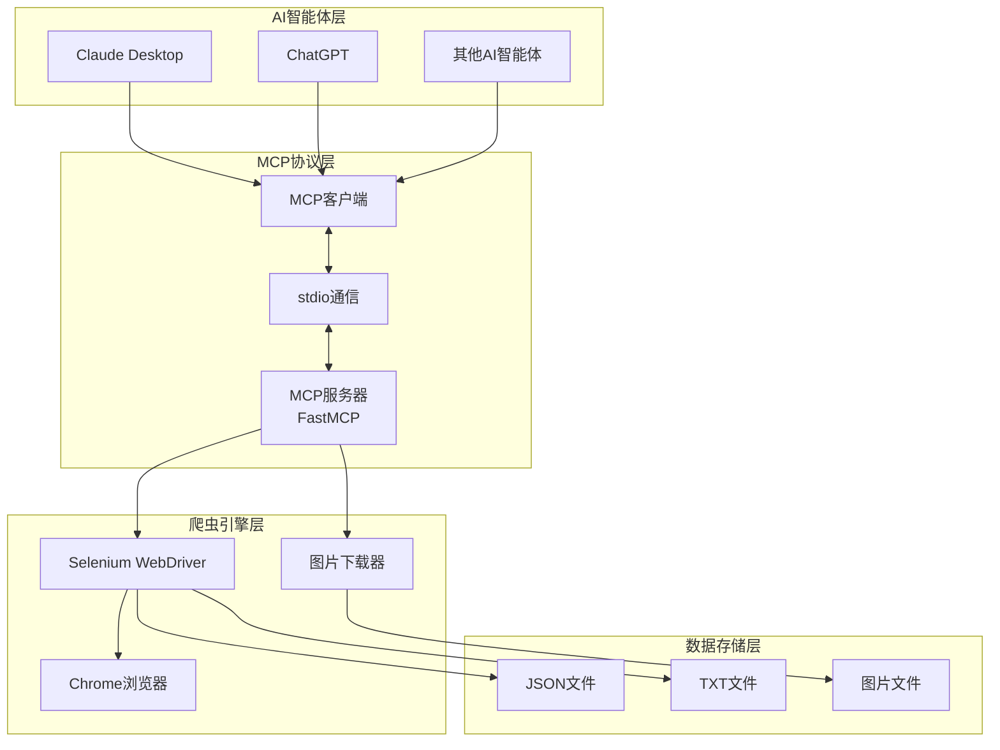

# MCP微信公众号爬虫

[!\[Python\](https://img.shields.io/badge/Python-3.8+-blue.svg null)](https://python.org)
[!\[MCP\](https://img.shields.io/badge/MCP-1.0+-green.svg null)](https://github.com/modelcontextprotocol)
[!\[FastMCP\](https://img.shields.io/badge/FastMCP-Latest-orange.svg null)](https://github.com/jlowin/fastmcp)
[!\[许可证\](https://img.shields.io/badge/许可证-Apache--2.0-yellow.svg null)](LICENSE)

修改自 [ditingdapeng/MCPWeChatOfficialAccounts](https://github.com/ditingdapeng/MCPWeChatOfficialAccounts)

基于 **FastMCP** 框架构建的微信公众号文章爬虫系统，让AI智能体能够直接访问和分析微信公众号内容。通过MCP (Model Context Protocol) 标准协议，实现AI智能体与Selenium爬虫的无缝集成。

## 🎯 项目背景

在使用AI平台或智能体时，我们发现智能体无法直接访问微信公众号文章内容。为了解决这个问题，我们开发了这个基于MCP协议的爬虫服务，让AI智能体能够获取和分析微信公众号的内容。

## ✨ 核心特性

- 🤖 **FastMCP框架** - 基于FastMCP高级封装，简化MCP服务器开发
- 🕷️ **智能爬虫** - 使用Selenium自动化浏览器，支持动态内容抓取
- 🖼️ **图片处理** - 自动下载文章图片并转换为本地文件
- 📊 **内容分析** - 提供文章统计、关键词提取等分析功能
- 🔌 **标准协议** - 完全兼容MCP 1.0+规范，支持stdio通信
- 🎯 **AI集成** - 可与Claude Desktop、ChatGPT等AI智能体无缝集成
- 💻 **多种接口** - 提供Python API和交互式命令行界面

## 🏗️ 系统架构



### 🔧 核心组件

#### 1. FastMCP服务器 (`src/mcp_weixin_spider/server.py`)

- 基于FastMCP框架的高级封装
- 提供3个核心工具：文章爬取、内容分析、统计信息
- 单例模式管理Selenium爬虫实例
- 完整的错误处理和参数验证
- 支持模块化启动和命令行脚本调用

#### 2. MCP标准客户端 (`src/mcp_weixin_spider/client.py`)

- 标准MCP协议客户端实现
- 异步通信和会话管理
- 交互式命令行界面
- Python API接口
- 支持通过命令行脚本启动

#### 3. 模块入口 (`src/mcp_weixin_spider/__main__.py`)

- 统一的模块启动入口
- 支持server和client两种运行模式
- 提供清晰的命令行帮助信息

#### 4. 配置管理 (`src/mcp_weixin_spider/config.py`)

- TOML格式配置文件支持
- 环境变量覆盖机制
- 类型安全的配置访问

#### 5. Selenium爬虫引擎 (`weixin_spider_simple.py`)

- Chrome浏览器自动化控制
- 智能ChromeDriver管理（自动安装和路径检测）
- 反爬虫机制处理
- 图片下载和格式转换
- 多格式文件保存
- 内存和性能优化

## 📁 项目结构

```
MCPWeChatOfficialAccounts/
├── src/
│   └── mcp_weixin_spider/
│       ├── __init__.py         # 包初始化文件
│       ├── __main__.py         # 模块入口点
│       ├── client.py           # MCP客户端实现
│       ├── config.py           # 配置管理
│       ├── main.py             # 主函数
│       └── server.py           # FastMCP服务器实现
├── weixin_spider_simple.py     # Selenium爬虫引擎
├── config.toml                 # 主配置文件
├── config.toml.example         # 配置文件示例
├── pyproject.toml              # 项目元数据和依赖管理
└── README.md                   # 项目文档
```

## 🚀 快速开始

### 📋 环境要求

- **Python**:  3.10+
- **浏览器**: Chrome/Chromium (自动管理ChromeDriver)
- **系统**: macOS/Windows/Linux

### 📦 安装步骤

### 传统安装（使用源码）

```bash
# 1. 克隆项目
git clone <repository-url>
cd MCPWeChatOfficialAccounts

# 2. 安装依赖
pip install .

# 3. 开发模式安装（可选，用于开发人员）
pip install -e .[dev]
```

### 使用pip安装

```bash
# 通过PyPI安装稳定版
pip install mcp-weixin-spider

# 或安装最新开发版
pip install git+<repository-url>
```

### 🔧 Trae IDE 配置指南

本部分提供了使用 Trae IDE 和 SOLO Coder 自动化配置 MCP 的详细说明。

#### 前置条件

- **Trae IDE**：从官方网站安装最新版本的 Trae IDE
- **SOLO Coder**：确保在 Trae IDE 设置中启用了 SOLO Coder
- **Python 3.8+**：已安装并可在 PATH 中访问
- **Chrome/Chromium**：已安装最新稳定版本
- **Git**：用于克隆仓库

#### 步骤 1：在 Trae IDE 中克隆仓库

1. 打开 Trae IDE 并创建一个新的工作区
2. 使用内置终端克隆仓库：
   ```bash
   git clone <repository-url>
   cd MCPWeChatOfficialAccounts
   ```
3. 在 Trae IDE 中打开项目文件夹

#### 步骤 2：为 MCP 配置启用 SOLO Coder

1. 在 Trae IDE 中，导航到 `设置 > 扩展 > SOLO Coder`
2. 如果尚未启用，请启用 SOLO Coder 扩展
3. 配置 SOLO Coder 设置：
   - 将 `Auto-detect MCP servers` 设置为 `Enabled`
   - 将 `Automate MCP configuration` 设置为 `Enabled`
   - 确保 `Python interpreter path` 指向您的 Python 3.8+ 安装

#### 步骤 3：使用 SOLO Coder 安装依赖

1. 在项目资源管理器中右键点击 `pyproject.toml` 文件
2. 选择 `SOLO Coder > Install Python Dependencies`
3. SOLO Coder 将自动：
   - 创建虚拟环境（如果尚未存在）
   - 从 `pyproject.toml` 安装所有必需的依赖
   - 验证安装是否成功

#### 步骤 4：配置 MCP 服务器设置

1. 在项目资源管理器中右键点击 `config.toml` 文件
2. 选择 `SOLO Coder > Configure MCP Server`
3. SOLO Coder 将引导您完成配置过程：
   - **爬虫设置**：
     - `headless`：生产环境设置为 `true`，调试时设置为 `false`
     - `wait_time`：根据您的网络速度调整（默认：10 秒）
     - `download_images`：设置为 `true` 以下载文章图片
     - `articles_dir`：保存爬取文章的路径（默认：`articles`）
     - `images_dir`：保存下载图片的路径（默认：`images`）
   - **MCP 设置**：
     - `server_name`：您的 MCP 服务器的唯一标识符
     - `transport`：设置为 `stdio` 以进行标准 MCP 通信
     - `debug`：设置为 `true` 以启用详细日志记录
   - **日志设置**：
     - `level`：日志级别（`DEBUG`、`INFO`、`WARNING`、`ERROR`）
     - `file`：日志文件路径（留空以仅在控制台记录）

#### 步骤 5：生成 MCP 配置文件

1. 在 Trae IDE 中，打开命令面板（Ctrl+Shift+P / Cmd+Shift+P）
2. 输入 `SOLO Coder: Generate MCP Configuration` 并选择它
3. SOLO Coder 将生成：
   - `mcp_server_config.yaml`：MCP 服务器配置文件
   - `launch.json`：VS Code/Trae IDE 启动配置
   - `tasks.json`：项目的构建和测试任务

#### 步骤 6：验证 MCP 服务器配置

1. 在 Trae IDE 中，打开终端
2. 运行验证命令：
   ```bash
   python -m mcp_weixin_spider verify
   ```
3. 检查输出是否有任何错误或警告
4. 如果验证通过，您将看到类似以下消息：
   ```text
   ✅ MCP 服务器配置验证成功！
   ✅ Selenium WebDriver 工作正常
   ✅ 检测到 Chrome/Chromium 浏览器
   ✅ 配置文件有效
   ```

#### 步骤 7：启动 MCP 服务器

1. 在 Trae IDE 中，打开 `src/mcp_weixin_spider/server.py` 文件
2. 点击右上角的 "Run" 按钮，或使用以下命令：
   ```bash
   python -m mcp_weixin_spider server
   ```
3. MCP 服务器应成功启动，并显示：
   ```text
   🚀 FastMCP Server starting...
   📡 Listening for MCP requests on stdio
   🤖 Ready to serve MCP tools!
   ```

#### 步骤 8：使用客户端测试 MCP 服务器

1. 在 Trae IDE 中打开一个新终端
2. 启动 MCP 客户端：
   ```bash
   python -m mcp_weixin_spider client
   ```
3. 使用交互式客户端测试 MCP 服务器：
   ```text
   > help
   Available tools: crawl_weixin_article, analyze_article, get_article_stats
   > crawl_weixin_article --url <weixin-article-url>
   ```
4. 验证服务器是否返回爬取的文章内容

#### 常见问题排查

| 问题                | 原因                         | 解决方案                                                                                                 |
| ----------------- | -------------------------- | ---------------------------------------------------------------------------------------------------- |
| ChromeDriver 未找到  | ChromeDriver 未安装或不在 PATH 中 | SOLO Coder 应自动处理此问题，但您也可以使用以下命令手动安装：`pip install chromedriver-autoinstaller`                         |
| MCP 服务器启动失败       | 配置错误或缺少依赖                  | 检查错误日志，使用以下命令验证依赖：`pip install -r requirements.txt`，并使用以下命令验证配置：`python -m mcp_weixin_spider verify` |
| SOLO Coder 未检测到项目 | 项目结构不标准                    | 确保项目根目录包含 `pyproject.toml` 和 `src/` 目录，并重启 Trae IDE                                                  |
| 客户端连接被拒绝          | 服务器未运行或传输设置不正确             | 验证服务器是否正在运行，检查 config.toml 中的 `transport` 设置是否为 `stdio`                                              |
| 文章爬取失败            | 网络问题或反爬虫机制                 | 在 config.toml 中增加 `wait_time`，调试时禁用无头模式，或检查文章 URL 是否可访问                                              |

#### SOLO Coder 高级功能

1. **自动生成 MCP 工具**：
   - 在 `server.py` 中右键点击任何 Python 函数
   - 选择 `SOLO Coder > Generate MCP Tool Definition`
   - SOLO Coder 将自动将该函数添加到 MCP 工具注册表
2. **调试 MCP 服务器**：
   - 在 `server.py` 中设置断点
   - 使用生成的 `launch.json` 配置在调试模式下运行服务器
   - 使用 MCP 客户端发送请求并逐步执行代码
3. **监控 MCP 流量**：
   - 在 SOLO Coder 设置中启用 `MCP Traffic Logging`
   - 在 Trae IDE 控制台中查看实时 MCP 请求/响应流量
4. **自动更新依赖**：
   - 在 SOLO Coder 设置中将 `Auto-update dependencies` 设置为 `Enabled`
   - 当 `pyproject.toml` 更改时，SOLO Coder 将自动更新依赖

### ⚙️ 配置管理

项目使用TOML格式的配置文件，支持通过配置文件和环境变量进行配置。

#### 配置文件

复制示例配置文件并根据需要修改：

```bash
cp config.toml.example config.toml
```

配置文件说明：

```toml
[spider]
headless = true          # 是否使用无头模式运行浏览器
wait_time = 10           # 页面等待时间（秒）
download_images = true   # 是否下载文章中的图片
articles_dir = "articles" # 文章保存目录
images_dir = "images"     # 图片保存目录

[mcp]
server_name = "mcp-weixin-spider" # MCP服务器名称
transport = "stdio"         # 传输方式
debug = false              # 是否启用调试模式

[log]
level = "INFO"              # 日志级别
format = "%(asctime)s - %(name)s - %(levelname)s - %(message)s" # 日志格式
file = ""                   # 日志文件路径（可选）
```

#### 环境变量

支持通过环境变量覆盖配置文件中的设置：

| 环境变量              | 对应配置项                   | 说明       |
| ----------------- | ----------------------- | -------- |
| HEADLESS          | spider.headless         | 是否使用无头模式 |
| WAIT\_TIME        | spider.wait\_time       | 页面等待时间   |
| DOWNLOAD\_IMAGES  | spider.download\_images | 是否下载图片   |
| ARTICLES\_DIR     | spider.articles\_dir    | 文章保存目录   |
| IMAGES\_DIR       | spider.images\_dir      | 图片保存目录   |
| MCP\_SERVER\_NAME | mcp.server\_name        | MCP服务器名称 |
| MCP\_TRANSPORT    | mcp.transport           | 传输方式     |
| MCP\_DEBUG        | mcp.debug               | 是否启用调试模式 |
| LOG\_LEVEL        | log.level               | 日志级别     |
| LOG\_FILE         | log.file                | 日志文件路径   |

### 🎮 启动方式

#### 使用命令行脚本（推荐）

```bash
# 启动MCP服务器
mcp-weixin-server

# 启动交互式客户端
mcp-weixin-client
```

#### 使用模块化启动

```bash
# 启动MCP服务器
python -m mcp_weixin_spider

# 启动MCP服务器（显式指定server模式）
python -m mcp_weixin_spider server

# 启动交互式客户端
python -m mcp_weixin_spider client
```

## 🛠️ MCP工具接口

```yaml
{
  "mcpServers": {
    "weixin_spider": {
      "command": "python",
      "args": [
        "-m", "mcp_weixin_spider"
      ],
      "env": {
        "ARTICLES_DIR": "articles",
        "DOWNLOAD_IMAGES": "true",
        "HEADLESS": "true",
        "WAIT_TIME": "10"
      }
    }
  }
}
```

### 工具列表

| 工具名称                   | 功能描述      | 参数                                                             | 返回值             |
| ---------------------- | --------- | -------------------------------------------------------------- | --------------- |
| `crawl_weixin_article` | 爬取微信公众号文章 | `url`: 文章URL`download_images`: 是否下载图片`custom_filename`: 自定义文件名 | 包含文章内容的JSON对象   |
| `analyze_article`      | 分析文章内容    | `article_content`: 文章内容                                        | 分析结果（关键词、统计信息等） |
| `get_article_stats`    | 获取文章统计信息  | `article_content`: 文章内容                                        | 文章统计数据          |

## 👨‍💻 开发指南

### 开发环境设置

```bash
# 克隆项目
git clone <repository-url>
cd MCPWeChatOfficialAccounts

# 安装开发依赖
pip install -e .[dev]

# 运行代码格式化
black src/ weixin_spider_simple.py

# 运行代码检查
flake8 src/ weixin_spider_simple.py

# 运行类型检查
mypy src/
```

### 项目构建

```bash
# 构建项目
python -m build

# 生成的包文件将位于 dist/ 目录
```

### 贡献指南

1. 遵循PEP 8编码规范
2. 使用Black进行代码格式化
3. 添加适当的类型注解
4. 确保所有代码通过flake8检查
5. 撰写清晰的提交信息
6. 提交前运行所有检查命令

